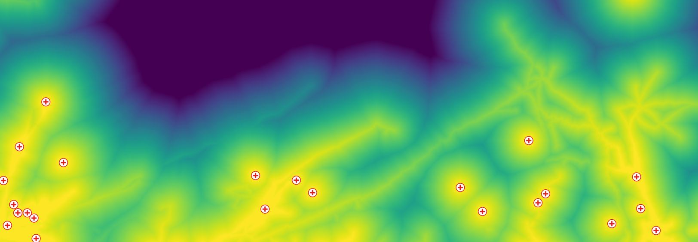

************************************************************
GeoHealthAccess: modeling accessibility to health facilities
************************************************************

Modeling population accessibility to health facilities has always been
tedious and time-consuming. From the selection of relevant data sources
to the modeling in itself, a wide range of skills and software solutions
are required. GeoHealthAccess is a tool that aims to automate the process
using a set of high resolution, global and open datasets -- in order to
enable fast and automated country-scaled analysis. To that end, input datasets
are automatically pulled from various sources:

* `Geofabrik <https://www.geofabrik.de/>`_ (OpenStreetMap) for the transport network ;
* `Copernicus Global Land Cover <https://lcviewer.vito.be/>`_ for land cover ;
* `Global Surface Water <https://global-surface-water.appspot.com/>`_ for surface water ;
* `Shuttle Radar Topography Mission <https://www2.jpl.nasa.gov/srtm/>`_ for topography ;
* and `WorldPop <https://www.worldpop.org/>`_ for population maps.

Health facilities (i.e. the destinations from which travel times are computed)
are the only dataset that have to be provided by the user. Travel speeds
associated with land cover categories and road network hierarchies are defined
according to the scientific literature, but may be adjusted by the user if
needed.

Here is an example of how the tool can be used::

   # Download input data
   geohealthaccess-download <config_file>

   # Preprocess input data
   geohealthaccess-preprocess <config_file>

   # Compute travel times and accessibility maps
   geohealthaccess-accessibility <config_file>

Example config file::

   [AREA]
   # Three-letter country code
   CountryCode = COD
   # Target CRS
   CRS = EPSG:3857
   # Target spatial resolution (in CRS units)
   Resolution = 100

   [DIRECTORIES]
   # Data directories
   InputDir = data/input
   IntermDir = data/intermediary
   OutputDir = data/output

   [EARTHDATA]
   # NASA EarthData credentials. Free registration here:
   # https://urs.earthdata.nasa.gov/users/new
   EarthDataUsername = <your_username>
   EarthDataPassword = <your_password>

   [MODELING]
   # Assign speeds depending on land cover and road network
   # If not provided, default values will be used.
   LandCoverSpeeds = data/land-cover.json
   RoadNetworkSpeeds = data/road-network.json

   [DESTINATIONS]
   Category1 = <your_health_facilities.shp>
   Category2 = <other_health_facilities.shp>

.. toctree::
   :maxdepth: 2
   :caption: Contents:

   index
   installation
   quick-start
   configuration
   methods
   example
   api

Indices and tables
==================

* :ref:`genindex`
* :ref:`modindex`
* :ref:`search`
